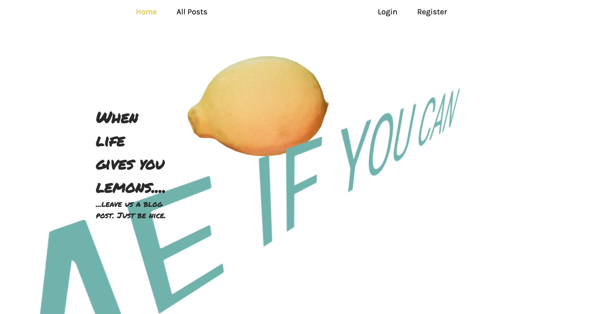

<br />
<p align="center">
  <a href="https://github.com/marialouisee/blog-me">
    <!--  -->
  </a>

  <h3 align="center">BLOG-ME</h3>

  <p align="center">
    <br />
    <a href="https://github.com/marialouisee/blog-me"><strong>Explore the docs »</strong></a>
    <br />
    <br />
    <!-- <a href="https://github.com/marialouisee/blog-me">View Demo</a>
    ·
    <a href="https://github.com/marialouisee/blog-me/issues">Report Bug</a>
    ·
    <a href="https://github.com/marialouisee/blog-me/issues">Request Feature</a> -->
  </p>
</p>


<!-- TABLE OF CONTENTS -->
<details open="open">
  <summary><h2 style="display: inline-block">Table of Contents</h2></summary>
  <ol>
    <li>
      <a href="#about-the-project">About The Project</a>
      <ul>
        <li><a href="#built-with">Built With</a></li>
      </ul>
    </li>
    <li>
      <a href="#getting-started">Getting Started</a>
      <ul>
        <li><a href="#prerequisites">Prerequisites</a></li>
        <li><a href="#installation">Installation</a></li>
      </ul>
    </li>
    <!-- <li><a href="#usage">Usage</a></li>
    <li><a href="#roadmap">Roadmap</a></li> -->
    <li><a href="#contributing">Contributing</a></li>
    <li><a href="#license">License</a></li>
    <li><a href="#contact">Contact</a></li>
    <li><a href="#acknowledgements">Acknowledgements</a></li>
  </ol>
</details>


<!-- ABOUT THE PROJECT -->
## About The Project

This is a fun blog project I am working on.

Still loads of work to do :)

Frondtend: React App, SASS

API - Full CRUD, Express, Mongoose

### Impressions 





### Built With

* React
* express
* mongoose
* ...

<!-- GETTING STARTED -->
## Getting Started

To get a local copy up and running follow these simple steps.

### Prerequisites

This is an example of how to list things you need to use the software and how to install them.
* npm
  ```sh
  npm install npm@latest -g
  ```

### Installation

1. Clone the repo
   ```sh
   git clone https://github.com/marialouisee/blog-me.git
   ```
2. Install NPM packages
   ```sh
    npm i
   ```
3. Create .env & .env.dev (soon more infos)

<!-- ROADMAP
## Roadmap


 -->


<!-- CONTRIBUTING -->
## Contributing

Contributions are what make the open source community such an amazing place to be learn, inspire, and create. Any contributions you make are **greatly appreciated**.

1. Fork the Project
2. Create your Feature Branch (`git checkout -b feature/AmazingFeature`)
3. Commit your Changes (`git commit -m 'Add some AmazingFeature'`)
4. Push to the Branch (`git push origin feature/AmazingFeature`)
5. Open a Pull Request


<!-- LICENSE -->
## License

Distributed under the MIT License. See `LICENSE` for more information.


<!-- CONTACT -->
## Contact

Maria Louise Genz - mariagenz@gmail.com
[LinkedIn](www.linkedin.com/in/maria-louise-genz)
Project Link: [https://github.com/marialouisee/blog-me](https://github.com/marialouisee/blog-me)


<!-- ACKNOWLEDGEMENTS -->
## Acknowledgements

...soon

<!-- API:
*   [bcryptjs](https://github.com/dcodeIO/bcrypt.js)
*   [connect-mongo](https://github.com/jdesboeufs/connect-mongo)
*   [cors](https://github.com/expressjs/cors)
*   [dotenv](https://github.com/motdotla/dotenv)
*   [faker](https://github.com/Marak/Faker.js)
*   [mongoose](https://mongoosejs.com/)
 -->

